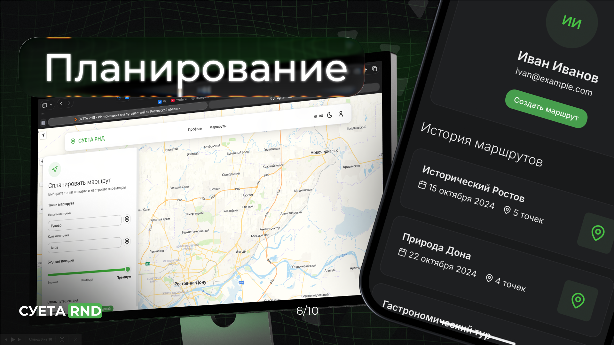
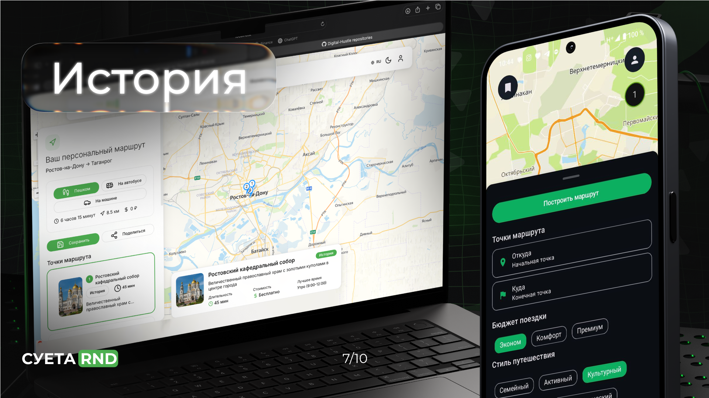

# 🗺️ СУЕТА RND Backend (Ростов-на-Дону)

Backend-часть приложения для построения интеллектуальных туристических маршрутов по городу Ростов-на-Дону. Разработана в рамках осеннего хакатона 2025.

[Frontend](https://github.com/Digital-Hustle/hackathon-2025-frontend) и [Android](https://github.com/Digital-Hustle/hackathon-2025-android)

## 🏗️ Архитектура

Проект состоит из 6 микросервисов:

- **`gateway`** — Единая точка входа (Spring Cloud Gateway)
- **`config-server`** — Сервер конфигураций (Spring Cloud Config)
- **`auth-ms`** — Сервис аутентификации и авторизации
- **`profile-ms`** — Сервис управления пользовательскими профилями
- **`event-ms`** — Сервис каталога мест и событий. 

## 🛠️ Технологический стек

- **Язык:** Java 21
- **Фреймворк:** Spring (Boot, Cloud, Security)
- **База данных:** PostgreSQL
- **API Gateway:** Spring Cloud Gateway
- **Конфигурация:** Spring Cloud Config Server + Git + Vault
- **Контейнеризация:** Docker
- **CI/CD:** GitHub Actions, GitLab CI
- **Регистр образов:** Docker Hub

## 📦 Описание микросервисов

### 🔐 auth-ms
Сервис авторизации и аутентификации
- Регистрация и вход пользователей
- Выдача и валидация JWT токенов

### 👤 profile-ms
Сервис профиля пользователя
- Хранение информации о пользователе 
- Управление интересами пользователя

### 🏛️ event-ms
Сервис мест и событий
- Каталог достопримечательностей Ростова-на-Дону
- Информация о местах и актуальных событиях
- Категоризация и поиск мест
- Построение оптимального маршрута
- Расчет расстояния между точками

### ⚙️ config-server
Централизованный сервис конфигураций
- Предоставление конфигураций из Git-репозитория
- Интеграция с HashiCorp Vault для секретов
- Единое управление настройками всех микросервисов

### 🚪 gateway
API Gateway
- Единая точка входа для всех запросов
- CORS и безопасность
- Аутентификация на уровне шлюза

## prod by _Digital Hustle_
