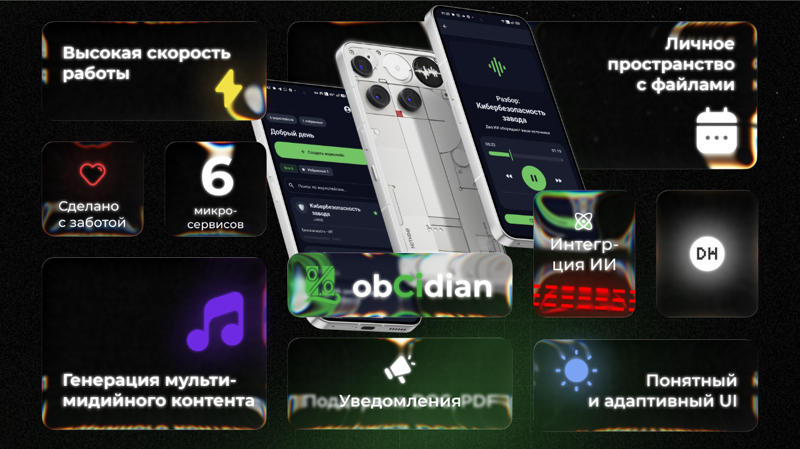
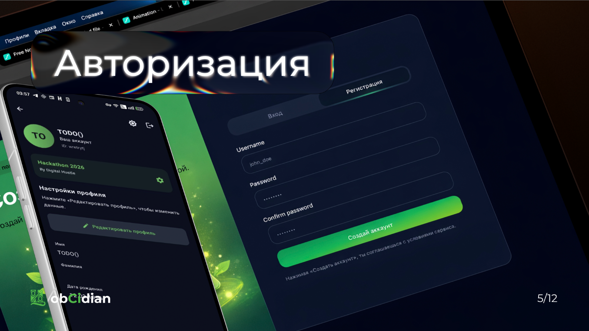
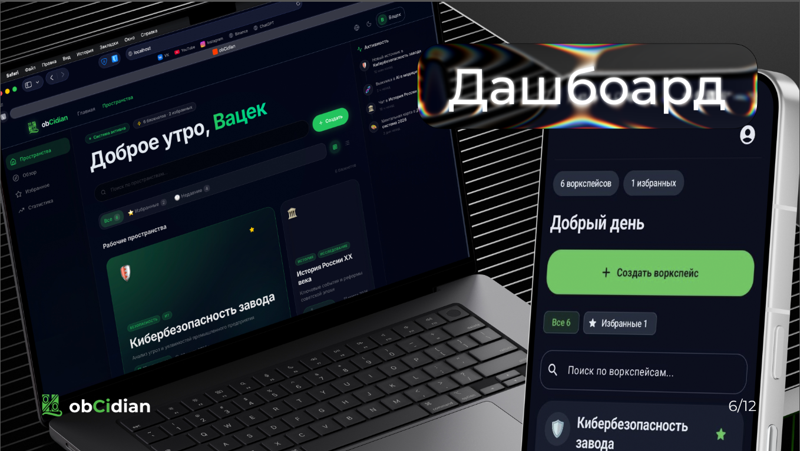
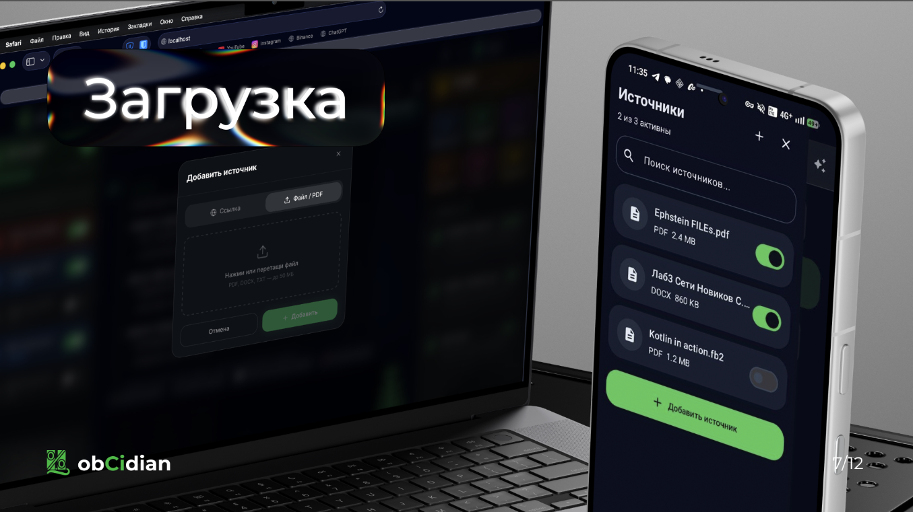
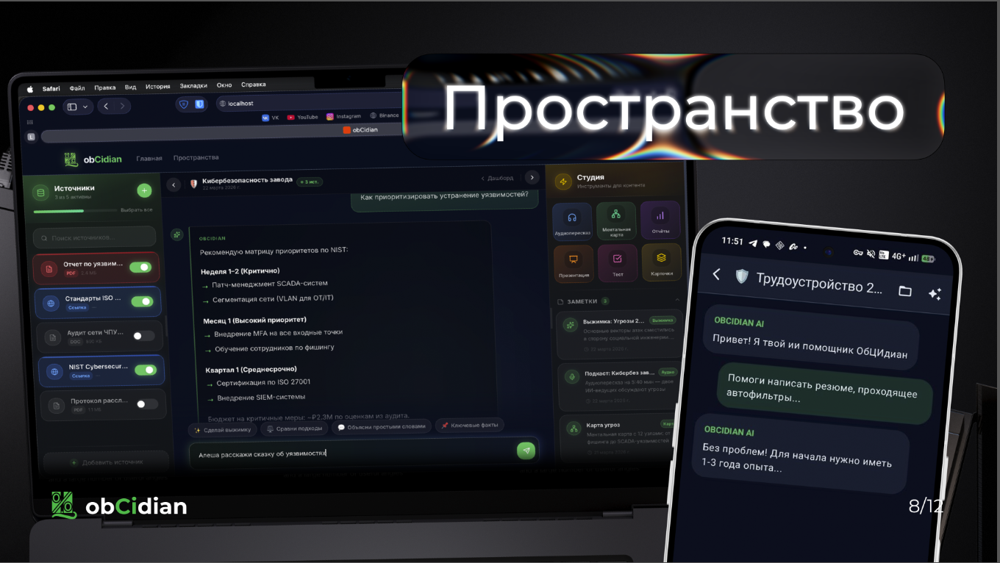
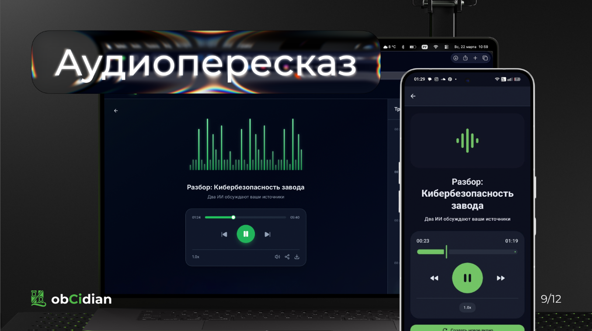
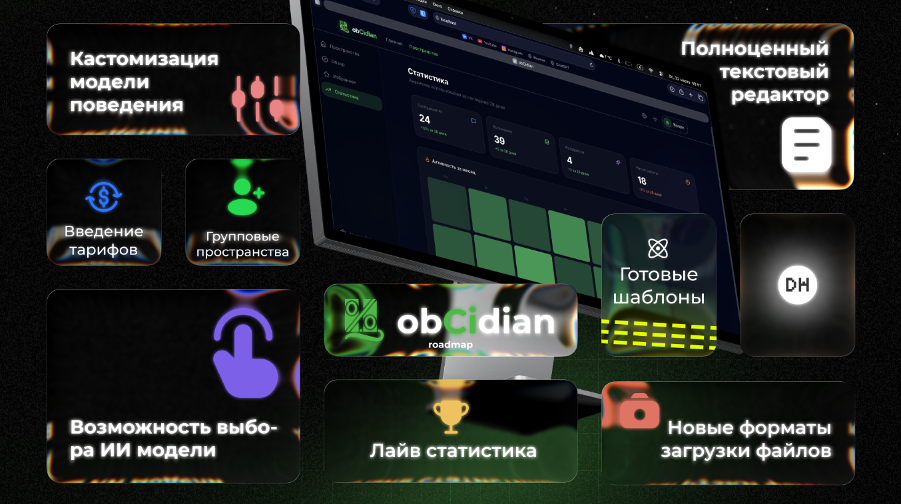

# 📓🤖 ObCidian

Backend-часть приложения для создания RAG ориентированных рабочих пространств.

[Frontend](https://github.com/Digital-Hustle/hackathon-spring-2026-frontend)
и [Android](https://github.com/Digital-Hustle/hackathon-spring-2026-android)

## 🏗️ Архитектура

Проект состоит из 6 микросервисов:

- **`gateway`** — Единая точка входа (Spring Cloud Gateway)
- **`config-server`** — Сервер конфигураций (Spring Cloud Config)
- **`auth-ms`** — Сервис аутентификации и авторизации
- **`profile-ms`** — Сервис управления пользовательскими профилями
- **`rag-workspace-ms`** — Сервис для создания workspace
- **`workspace-processor-ms`** — Сервис манипуляции над данными workspace'а (создание Ai подкаста)

## 🛠️ Технологический стек

- **Язык:** Java 21
- **Система сборки:** Gradle
- **Фреймворк:** Spring (Boot, Cloud, Security)
- **Хранилища данных:** PostgreSQL, pgvector, Minio
- **API Gateway:** Spring Cloud Gateway
- **Конфигурация:** Spring Cloud Config Server + Git + Vault
- **Контейнеризация:** Docker
- **CI/CD:** GitHub Actions, GitLab CI
- **Регистр образов:** Docker Hub

## 📦 Описание микросервисов

### 🔐 auth-ms

Сервис авторизации и аутентификации

- Регистрация и вход пользователей
- Выдача и валидация JWT токенов

### 👤 profile-ms

Сервис профиля пользователя

- Хранение информации о пользователе
- Управление интересами пользователя

### 🏛️ rag-workspace-ms

RAG сервис

* Создание workspace'ов
* Парсинг txt, docs, pdf файлов
* Загрузка и хранение файлов
    * Pgvector (хранение векторов)
    * Minio
    * postgres (мета информация)
* ИИ чат

### 🏛️ workspace-processor-ms

Управление воркспейсом
* Создание ИИ-подкаста в виде аудиофайла

### ⚙️ config-server

Централизованный сервис конфигураций

- Предоставление конфигураций из Git-репозитория
- Интеграция с HashiCorp Vault для секретов
- Единое управление настройками всех микросервисов

### 🚪 gateway

API Gateway

- Единая точка входа для всех запросов
- CORS и безопасность
- Аутентификация на уровне шлюза

## prod by _Digital Hustle_
