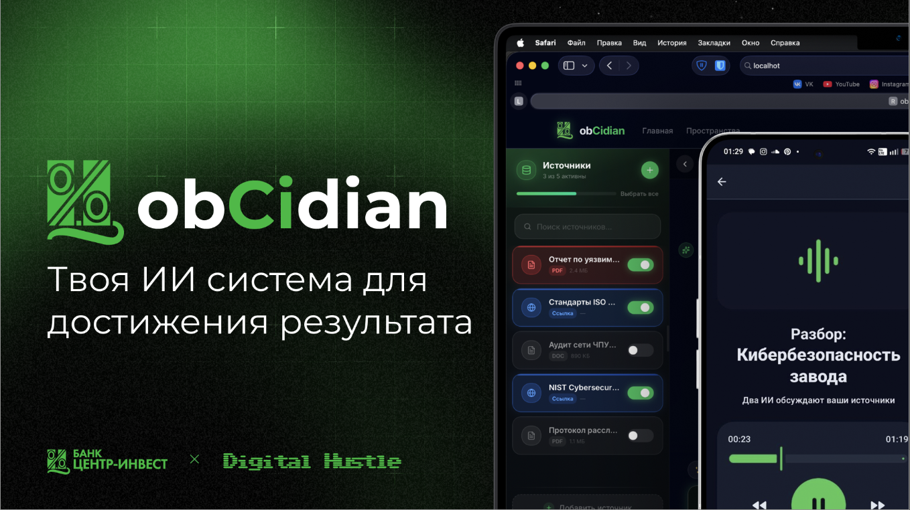
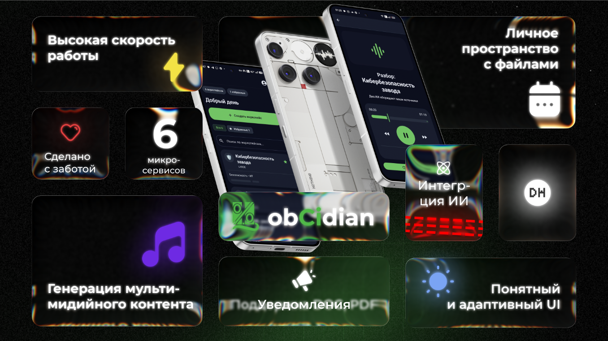
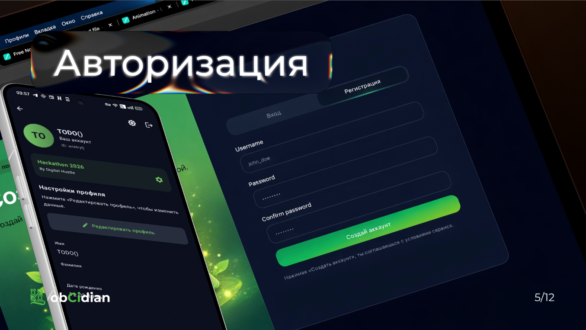
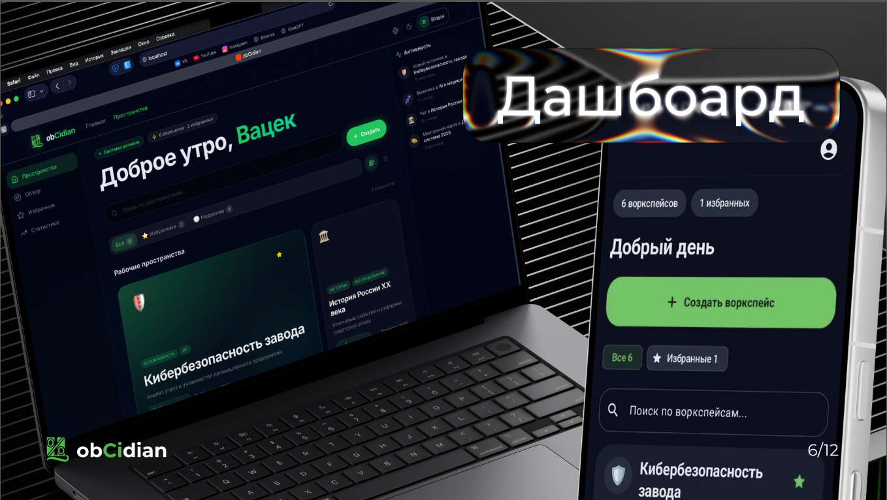
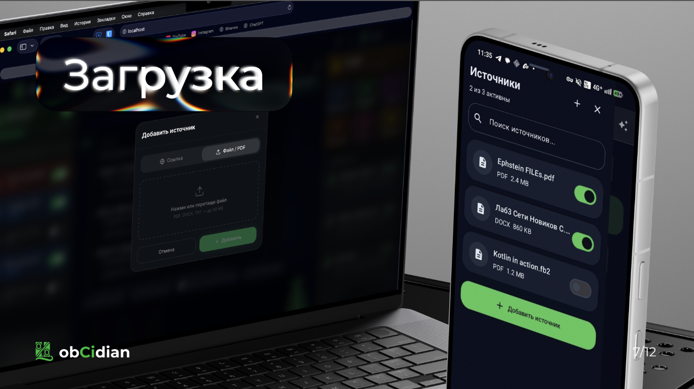
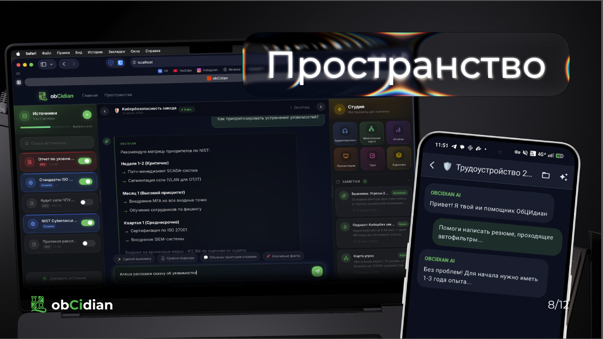
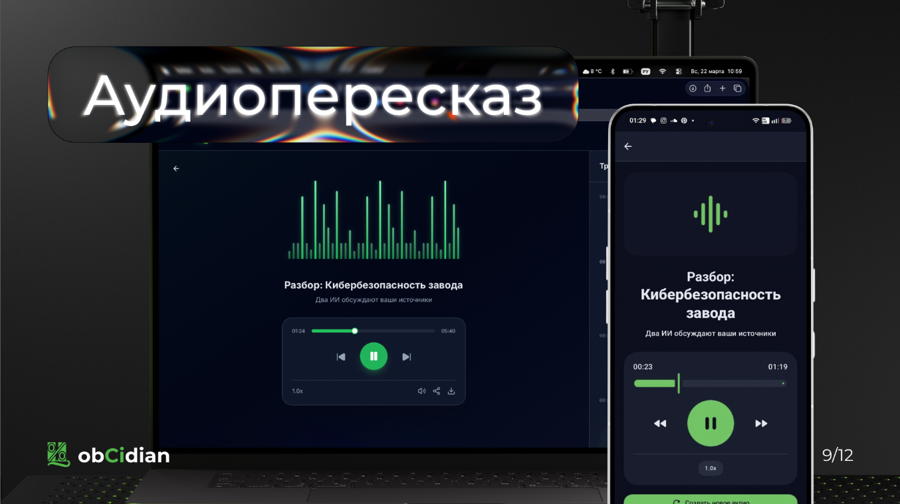
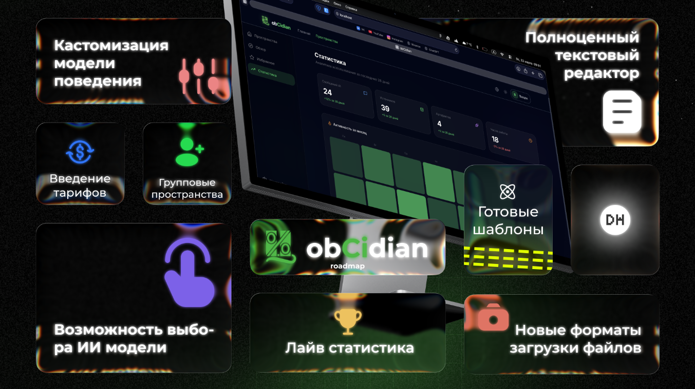

# 📓🤖 ObCidian

Backend-часть приложения для создания RAG ориентированных рабочих пространств.

[Frontend](https://github.com/Digital-Hustle/hackathon-spring-2026-frontend)
и [Android](https://github.com/Digital-Hustle/hackathon-spring-2026-android)



## 🏗️ Архитектура

Проект состоит из 6 микросервисов:

- **`gateway`** — Единая точка входа (Spring Cloud Gateway)
- **`config-server`** — Сервер конфигураций (Spring Cloud Config)
- **`auth-ms`** — Сервис аутентификации и авторизации
- **`profile-ms`** — Сервис управления пользовательскими профилями
- **`rag-workspace-ms`** — Сервис для создания workspace
- **`workspace-processor-ms`** — Сервис манипуляции над данными workspace'а (создание Ai подкаста)



## 🛠️ Технологический стек

- **Язык:** Java 21
- **Система сборки:** Gradle
- **Фреймворк:** Spring (Boot, Cloud, Security)
- **Хранилища данных:** PostgreSQL, Qdrant, Minio
- **API Gateway:** Spring Cloud Gateway
- **Конфигурация:** Spring Cloud Config Server + Git + Vault
- **Контейнеризация:** Docker
- **CI/CD:** GitHub Actions, GitLab CI
- **Регистр образов:** Docker Hub

## 📦 Описание микросервисов



### 🔐 auth-ms

Сервис авторизации и аутентификации

- Регистрация и вход пользователей
- Выдача и валидация JWT токенов

### 👤 profile-ms

Сервис профиля пользователя

- Хранение информации о пользователе
- Управление интересами пользователя



### 🏛️ rag-workspace-ms

RAG сервис

* Создание workspace'ов
* Парсинг txt, docs, pdf файлов
* Загрузка и хранение файлов
    * Qdrant (хранение векторов)
    * Minio
    * postgres (мета информация)
* ИИ чат

Qdrant запускается вместе с остальной инфраструктурой из
`docker/docker-compose.infrastructure.yml` и доступен приложению на порту `6333`.
Размер embedding и имя коллекции настраиваются через `QDRANT_VECTOR_SIZE` и
`QDRANT_COLLECTION`.
При запуске backend автоматически переносит старые chunks из `rag.vector_store`
в Qdrant и удаляет старую таблицу и расширение только после успешной записи всех chunks.
AI-модели можно переопределить через `AI_CHAT_MODEL`, `AI_EMBEDDING_MODEL` и
`YANDEX_GPT_MODEL`; при замене embedding-модели также задайте ее размер в `QDRANT_VECTOR_SIZE`.

#### Локальные AI-модели через Docker

Для разработки можно запускать локальный Ollama с GPU и хранить модели в Docker volume:
для генерации используется [открытая GigaChat 3.1 Lightning от Сбера](https://huggingface.co/ai-sage/GigaChat3.1-10B-A1.8B-GGUF)
в квантизации Q4_K_M (10 млрд параметров, 1,8 млрд активных; около 6,5 ГБ),
для эмбеддингов — Qwen3-Embedding-0.6B (1024 измерения).

```bash
docker compose -f docker/docker-compose.ollama.yml up -d
docker exec sber-hack-ollama ollama pull Bored/GigaChat3.1-10B-A1.8B-q4_K_M
docker exec sber-hack-ollama ollama pull qwen3-embedding:0.6b
```

Для backend-контейнера задайте `AI_CHAT_URL=http://host.docker.internal:11434`,
`AI_CHAT_MODEL=Bored/GigaChat3.1-10B-A1.8B-q4_K_M`, `AI_CHAT_API_KEY=ollama`,
`AI_EMBEDDING_URL=http://host.docker.internal:11434/v1`,
`AI_EMBEDDING_MODEL=qwen3-embedding:0.6b`, `AI_EMBEDDING_API_KEY=ollama` и
`QDRANT_VECTOR_SIZE=1024`. Для процесса, запущенного непосредственно на хосте,
замените `host.docker.internal` на `localhost`.




### 🏛️ workspace-processor-ms

Управление воркспейсом
* Создание ИИ-подкаста в виде аудиофайла



### ⚙️ config-server

Централизованный сервис конфигураций

- Предоставление конфигураций из Git-репозитория
- Интеграция с HashiCorp Vault для секретов
- Единое управление настройками всех микросервисов

### 🚪 gateway

API Gateway

- Единая точка входа для всех запросов
- CORS и безопасность
- Аутентификация на уровне шлюза



## prod by _Digital Hustle_
